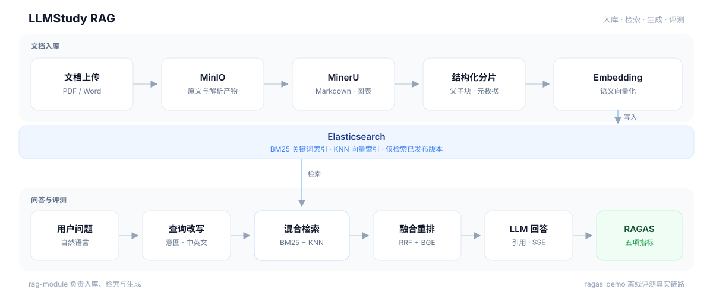

# LLMStudy RAG

面向文档知识库的端到端 RAG 实践项目：从 PDF/Word 入库、混合检索到流式回答，并可用 RAGAS 对真实链路做离线评测。

- **rag-module**：Java RAG 服务（文档流水线、检索、对话、权限与内置页面）
- **ragas_demo**：Python 评测工具（调用在线 RAG 接口，计算五项 RAGAS 指标）



## 功能特点

和常见「切一段文本 + 向量检索」的 Demo 不同，这里按论文知识库把入库、上线、检索和评测收成一条可运行链路。

- **按论文结构来切，而不是按字数硬切**：MinerU 解析出 Markdown、页码、图和表；正文保留标题路径，图可补 Vision 描述，表作为原子块。超长章节走父子分片——child 负责召回，parent 在回答时展开，避免模型只看到半个方法节。
- **入库和上线分开**：逻辑文档与物理版本是两层。新版本可以先解析、分片、建好索引，未发布不会进检索；发布只切换当前版本，回滚也不用重新向量化。
- **混合检索是完整的一路，不是单路向量**：先做意图识别和中英改写，再并行 BM25 + KNN，RRF 融合后用本地 BGE Cross-Encoder 重排，回答带引用来源。
- **流水线可恢复**：解析 → 分片 → 向量化按状态推进，阶段幂等，失败或卡住会自动补偿，避免「上传成功但永远问不到」。
- **评测打在真实链路上**：`ragas_demo` 不另写一套检索，而是 HTTP 调用同一条 `RagPipeline`，用 RAGAS 五项指标看改写、召回、重排和生成，每次 run 独立落盘。


## 技术栈


| 层级  | 选型                                             |
| --- | ---------------------------------------------- |
| 运行时 | Java 21、Spring Boot 4、Spring AI                |
| 检索  | Elasticsearch 8.19（BM25 + KNN + RRF）、本地 BGE 重排 |
| 存储  | MySQL 8、Redis、MinIO                            |
| 解析  | MinerU API，可选 Vision 模型生成图片描述                  |
| 鉴权  | Sa-Token、BCrypt                                |
| 评测  | Python 3.10+、uv、RAGAS                          |


对话与 Embedding 均使用 OpenAI 兼容接口，可对接 DeepSeek、DashScope 等。

## 环境要求


| 组件             | 版本    | 用途                           |
| -------------- | ----- | ---------------------------- |
| JDK            | 21    | 运行 rag-module                |
| Maven          | 3.9+  | 构建                           |
| Python         | 3.10+ | 运行 ragas_demo                |
| uv             | 较新版本  | Python 依赖管理                  |
| Docker Compose | v2    | 启动 MySQL、Elasticsearch、MinIO |


另外需要：

- **Redis**：登录态与会话缓存（Compose 未编排，需单独启动）
- **Elasticsearch 8.19.x + IK 分词插件**：索引 mapping 使用 `ik_max_word` / `ik_smart`，请使用已安装同版本 IK 插件的镜像
- **OpenAI 兼容的 Chat / Embedding API**
- **MinerU API**：PDF / Word 解析
- **Vision API**（可选）：论文图片描述


## 快速开始


### 1. 启动基础设施

```bash
# 将 docker-compose.yml 中的 Elasticsearch 镜像换成已安装 IK 插件的 8.19.x 镜像后：
docker compose -f rag-module/doc/docker-compose.yml up -d

docker run -d --name rag-redis --restart unless-stopped \
  -p 6379:6379 redis:7-alpine
```

默认端口：MySQL `3306`、Elasticsearch `9200`、MinIO API `9000`、MinIO Console `9001`、Redis `6379`。

Compose 中的账号密码仅供本地开发，见 `rag-module/doc/docker-compose.yml`，部署到公网前请全部替换。

### 2. 配置并启动 rag-module

```bash
cd rag-module
cp src/main/resources/application.example.yml \
   src/main/resources/application.yml
```

按实际环境导出密钥（下面是本地 Compose 的示例值）：

```bash
export MYSQL_PASSWORD='rag_mysql_dev_2026'
export DEEPSEEK_API_KEY='<chat-api-key>'
export OPENAI_BASE_URL='https://api.deepseek.com'
export CHAT_MODEL='<chat-model>'

export EMBEDDING_BASE_URL='<embedding-compatible-base-url>'
export EMBEDDING_MODEL='<embedding-model>'
export EMBEDDING_API_KEY='<embedding-api-key>'
export EMBEDDING_DIMENSIONS='1536'

export MINIO_ENDPOINT='http://localhost:9000'
export MINIO_ACCESS_KEY='minioadmin'
export MINIO_SECRET_KEY='rag_minio_dev_2026'
export MINERU_TOKEN='<mineru-token>'

# 尚未准备 BGE ONNX 模型时先关闭重排
export BGE_RERANKER_ENABLED='false'

mvn spring-boot:run
```

启用本地 BGE 重排时，将模型放到：

```text
rag-module/models/bge-reranker/model_quantized.onnx
rag-module/models/bge-reranker/tokenizer.json
```

也可通过 `BGE_RERANKER_MODEL_PATH`、`BGE_RERANKER_TOKENIZER_PATH` 指向仓库外的文件。模型不会打进 JAR。

常用环境变量：


| 变量                                                    | 说明                   |
| ----------------------------------------------------- | -------------------- |
| `MYSQL_*` / `REDIS_*`                                 | 数据库与 Redis           |
| `DEEPSEEK_API_KEY` / `OPENAI_BASE_URL` / `CHAT_MODEL` | 对话模型                 |
| `EMBEDDING_*`                                         | Embedding 接口、模型与向量维度 |
| `ELASTICSEARCH_URI` / `ELASTICSEARCH_VECTOR_INDEX`    | Elasticsearch 地址与索引  |
| `MINIO_*`                                             | 对象存储                 |
| `MINERU_TOKEN`                                        | 文档解析                 |
| `VISION_*`                                            | 可选图片理解               |
| `BGE_RERANKER_*`                                      | 本地重排开关与模型路径          |


Embedding 输出维度须与 Elasticsearch mapping 一致，当前默认 `1536`。若 MinerU 跑在另一台机器上，`MINIO_ENDPOINT` 必须是 MinerU 能访问的地址，不要用仅本机有效的 `localhost`。

### 3. 打开内置页面

启动后访问：

- 登录：[http://localhost:8080/login.html](http://localhost:8080/login.html)
- 文档上传：[http://localhost:8080/upload.html](http://localhost:8080/upload.html)
- RAG 对话：[http://localhost:8080/chat.html](http://localhost:8080/chat.html)

`schema.sql` 内置演示账号 `alice`、`bob`、`org_admin`、`sys_admin`，默认密码均为 `ChangeMe123!`，仅用于本地体验。

一篇文档从上传到可问答：

1. 登录并上传 PDF / DOC / DOCX。
2. 等待版本 `processingStatus=VECTOR_STORED` 且 `releaseStatus=READY`。
3. 调用发布接口；首次发布时 `expectedCurrentVersionId` 为 `null`。
4. 版本变为 `PUBLISHED` 后即可问答。


### 4. 使用 HTTP API

登录并取出响应中的 `data.token`：

```bash
curl -X POST http://localhost:8080/auth/login \
  -H 'Content-Type: application/json' \
  -d '{"username":"alice","password":"ChangeMe123!"}'
```

上传：

```bash
curl -X POST http://localhost:8080/document/upload \
  -H 'Authorization: Bearer <token>' \
  -F 'file=@/absolute/path/to/document.pdf' \
  -F 'docTitle=示例文档' \
  -F 'visibility=PRIVATE'
```

用上传响应中的 `docId`、`versionId`，处理完成后发布：

```bash
curl http://localhost:8080/document/<docId>/versions/<versionId> \
  -H 'Authorization: Bearer <token>'

curl -X POST \
  http://localhost:8080/document/<docId>/versions/<versionId>/publish \
  -H 'Authorization: Bearer <token>' \
  -H 'Content-Type: application/json' \
  -d '{"expectedCurrentVersionId":null}'
```

SSE 流式对话：

```bash
curl -N -X POST http://localhost:8080/chat/client/stream \
  -H 'Authorization: Bearer <token>' \
  -H 'Content-Type: application/json' \
  -d '{"conversationId":null,"query":"请总结这篇文档的核心方法"}'
```


## RAGAS 评测

`ragas_demo` 从金标 JSONL 读取问题，调用 rag-module 生成回答与检索上下文，再计算 Context Precision、Context Recall、Answer Relevancy、Faithfulness、Answer Correctness。

```bash
cd ragas_demo
cp .env.example .env
uv sync --locked
```

`.env` 需要两套独立的 OpenAI 兼容配置：

- `OPENAI_*`、`RAGAS_LLM_MODEL`：RAGAS 裁判模型
- `EMBEDDING_*`：Answer Relevancy / Answer Correctness 用的向量模型
- `RAG_BASE_URL`：已启动的 rag-module 地址，默认 `http://localhost:8080`

若对话模型（例如 DeepSeek）不提供 Embedding，不要把评测 LLM 与 Embedding 配成同一个 Base URL。

确保 rag-module 已启动、相关文档已发布后：

```bash
# 生成样本并评分，可用 --limit 做冒烟
uv run python -m ragas_demo.run --limit 3

uv run python -m ragas_demo.generate_dataset
uv run python -m ragas_demo.evaluate

uv run python -m ragas_demo.evaluate \
  --input data/runs/<run-id>/generated.jsonl
```

默认金标：`rag-module/doc/test/medical-image-segmentation-ragas-qa.jsonl`。每次运行写入独立目录：

```text
ragas_demo/data/runs/<YYYYMMDD-HHMMSS>/
├── generated.jsonl    # RAG 回答与检索上下文
└── scores.json        # 逐条分数与指标均值
```


## 测试

```bash
mvn -f rag-module/pom.xml test

cd ragas_demo
uv run python -m unittest discover -s src/ragas_demo -p '*_test.py'
```


## 项目结构

```text
LLMStudy/
├── rag-module/                      # Java RAG 主服务
│   ├── pom.xml
│   ├── models/bge-reranker/         # 本地 BGE 模型（默认不入库）
│   ├── doc/                         # 架构、部署与测试材料
│   └── src/
│       ├── main/java/com/llmstudy/rag/
│       │   ├── auth/                # 认证与资源权限
│       │   ├── client/              # MinerU、Vision 客户端
│       │   ├── config/
│       │   ├── controller/          # 文档、对话、数据集 API
│       │   ├── entity/              # MySQL 实体
│       │   ├── mapper/              # MyBatis
│       │   └── module/
│       │       ├── knowledge/       # 文档、分片、向量化
│       │       ├── rag/             # 改写、检索、融合、重排
│       │       ├── chat/            # 对话编排与会话
│       │       └── dataset/         # RAGAS 样本生成接口
│       ├── main/resources/
│       │   ├── application.example.yml
│       │   ├── schema.sql
│       │   ├── elasticsearch/
│       │   ├── prompts/
│       │   └── static/              # 登录、上传、对话页
│       └── test/
└── ragas_demo/                      # Python RAGAS 评测
    ├── pyproject.toml
    ├── uv.lock
    ├── .env.example
    └── src/ragas_demo/
        ├── generate_dataset.py
        ├── evaluate.py
        ├── run.py
        └── paths.py
```
